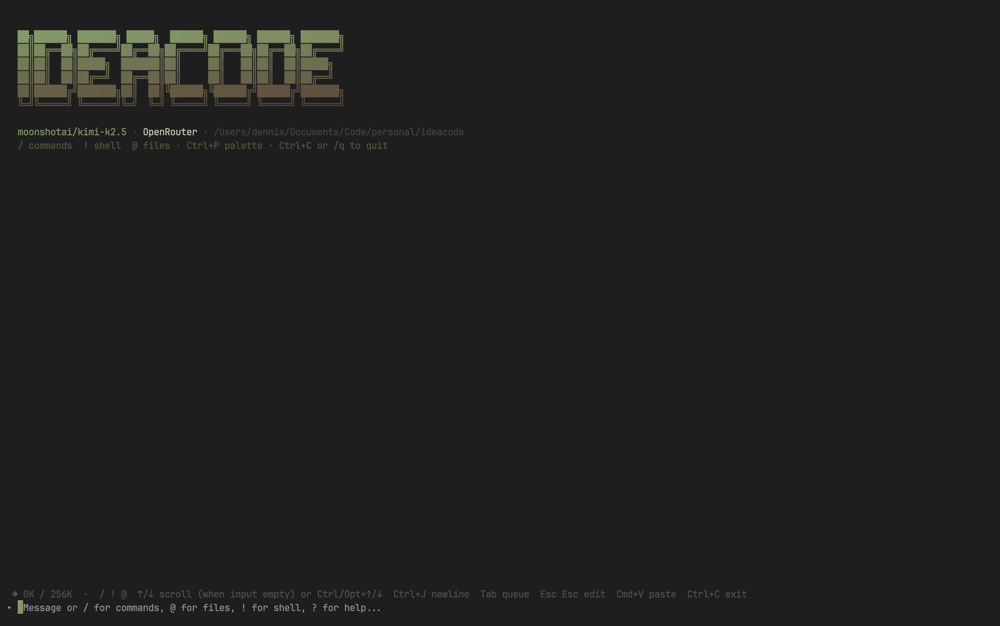

# ideacode

CLI TUI for interfacing with AI agents via OpenRouter. Agentic loop with tool use, conversation history, and markdown output.



## Setup

```bash
npm i -g ideacode
```

`npm install` runs `playwright install chromium` automatically (for **web_fetch** on JS-rendered pages). If you skipped install scripts or see "Executable doesn't exist", run `npx playwright install chromium` once.

## Usage

```bash
npm run run
# or after build: npm run build && npm start
```

On first run, you'll be prompted for your OpenRouter API key. Get one at [openrouter.ai/keys](https://openrouter.ai/keys). You can optionally configure **web search**: a [SearXNG](https://docs.searxng.org/) instance base URL (preferred, e.g. `http://127.0.0.1:8080`) and/or a [Brave Search API](https://brave.com/search/api) key (fallback). Settings are saved to:

- **macOS/Linux:** `~/.config/ideacode/config.json`
- **Windows:** `%LOCALAPPDATA%\ideacode\config.json`

### Environment (optional)

- `OPENROUTER_API_KEY` — API key (skips onboarding if set)
- `MODEL` — Model ID (e.g. `anthropic/claude-sonnet-4`, `openai/gpt-4o`)
- `SEARXNG_URL` — SearXNG base URL (enables **web_search**; tried first). Example: `http://127.0.0.1:8080`. Your instance must allow JSON results (`format=json`). If you see **403** from a **public** instance, use a **local** Docker SearXNG and relax bot protection (e.g. in `settings.yml`: `server.limiter: false` for private use, or allow your IP).
- `BRAVE_API_KEY` or `BRAVE_SEARCH_API_KEY` — Brave Search API key (**web_search** fallback if SearXNG fails or is unset)

## Commands

- **Ctrl+P** — Open command palette (switch model, set SearXNG URL, Brave key, etc.)
- **Type `/`** — Inline command suggestions with descriptions (arrow keys to select, Enter to run)
- `/` or `/palette` — Same as Ctrl+P (open command palette)
- `/models` — Switch model (opens model selector)
- `/searxng` (or `/searx`) — Set SearXNG base URL (**web_search**, preferred)
- `/brave` — Set Brave Search API key (**web_search** fallback)
- `/c` or `/clear` — Clear conversation
- `/q` or `exit` — Quit

## Tools

`read`, `write`, `edit`, `glob`, `grep`, `bash`. Plus:

- **web_fetch** — Fetch a URL and return main text. Tries plain `fetch()` first (works for raw GitHub, static HTML, APIs); falls back to Playwright for JS-rendered pages.
- **web_search** — Search the web. Uses your [SearXNG](https://docs.searxng.org/) instance first (`SEARXNG_URL` or `/searxng`), then [Brave Search API](https://brave.com/search/api) if configured. The agent only sees this tool when at least one backend is set.

**web_fetch** uses Chromium for JS-rendered pages; it is installed automatically via postinstall. If you see "Executable doesn't exist", run `npx playwright install chromium` in the project directory.

## Terminal UI

The REPL uses **Ink** (React for the terminal) with a custom input: full-screen takeover, message log in a fixed viewport, hint row above input, slash/at suggestions above input. Run in an **interactive terminal** (real TTY); piping stdin or non-TTY may show "Raw mode is not supported".

## Project structure

- `src/index.tsx` — Entry: config/onboarding, then renders REPL
- `src/Repl.tsx` — Main UI: input, log, suggestions, modals, API loop
- `src/api.ts` — OpenRouter API (models, chat with tools)
- `src/config.ts` — API key and model (env + `~/.config/ideacode/config.json`)
- `src/commands.ts` — Slash commands and palette
- `src/onboarding.ts` — First-run API key prompt
- `src/tools/` — Agent tools (read, write, grep, bash, web_fetch, web_search, …)
- `src/ui/` — Formatting and theme (markdown, colors, boxes)
